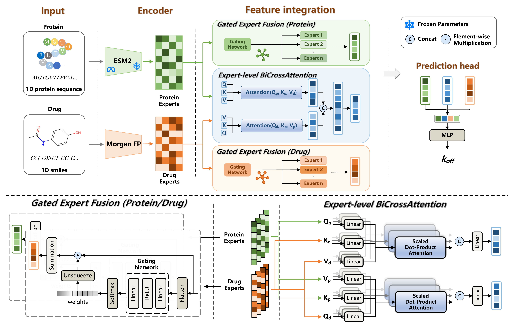

# MGCA-koff

Official reproducibility repository for **Multi-Granularity Cross-Attention
Mixture-of-Experts for Protein--Ligand Dissociation Kinetics Prediction**.

This version contains the final MGCA implementation, frozen configurations,
data splits, hyperparameter-search evidence, benchmark and ablation results,
baseline implementations, and case-study materials used in the revised
manuscript.

## Model architecture

[](figures/MGCA_architecture.pdf)

The figure summarizes the ESM2 and Morgan-fingerprint encoders, modality-specific
gated expert fusion, expert-level bidirectional cross-attention, and the final
dissociation-rate prediction head. Select the image to open the vector PDF.

## Repository contents

- `data/`: KinetX and Zhao dataset files used by the released workflows. The
  Zhao dataset contains 2,773 records; subsequent references use the short name
  "Zhao dataset".
- `data_preparation/`: data-conversion and audit utilities.
- `model/`: final MGCA implementation and supporting modules.
- `experiments/final_v10/`: training, tuning, ablation, and timing entry points.
- `results/final_v10/`: frozen search records and formal benchmark/ablation
  outputs. Transient logs, diagnostic arrays, training predictions, and locks
  are intentionally excluded.
- `results/sensitivity/`: compact analyses supporting the final fusion
  initialization search space.
- `baselines/` and `results/baseline_tuning_evidence/`: baseline code and
  retained tuning evidence.
- `case_study/code/`: final case-study workflow and inputs.
- `case_study/results/`: final five-refit outputs and checkpoint provenance;
  checkpoint binaries are not distributed.
- `inference_service/`: checkpoint-compatible FastAPI service.
- `figures/`: final architecture figure in GitHub-preview PNG and vector PDF
  formats.

## Installation

Create an environment compatible with the local CUDA installation and install
the Python dependencies:

```bash
git clone https://github.com/CSUBioGroup/MGCA-koff.git
cd MGCA-koff
pip install -r requirements.txt
```

The ESM2 `esm2_t36_3B_UR50D` weights are not redistributed. Set `ESM2_PATH` to
the local model directory before running workflows that extract protein
features.

## Running the released workflows

Formal experiment entry points are under `experiments/final_v10/`. The final
case-study entry point is:

```bash
cd case_study/code
ESM2_PATH=/absolute/path/to/esm2_t36 bash run_all_case_study.sh
```

The inference service requires a separately supplied trained checkpoint and
ESM2 asset. See `inference_service/README.md` for placement and launch details.

## Release identity and integrity

The authoritative final case-study configuration ID is:

```text
3154ac214828eafe59655160112af7c34eaf8be4cf739ed0ed21f2eb460d2b30
```

It uses five independent full-cohort Zhao dataset refits (seeds 42, 142, 242,
342, and 442), each trained for 33 fixed epochs. Their manifests, histories,
predictions, analyses, and figures are retained, but their checkpoint binaries
are not included.

Verify the repository from its root:

```bash
python verify_release.py
```

The verifier checks required content, complete SHA256 coverage, release
metadata, the absence of excluded artifacts, final case-study identity,
superseded output IDs, inventory totals, and leaked private absolute paths. The
same check runs automatically through GitHub Actions.

## Reproducibility notes

- Benchmark outputs include per-run metrics, validation/test predictions,
  histories, frozen configurations, Optuna databases, and aggregate reports.
- Hyperparameter trials do not contain test predictions; final test evaluation
  is retained only for formal runs.
- Case-study provenance manifests retain seed, epoch, configuration ID,
  original checkpoint hash, and training history even though checkpoint
  binaries are omitted.
- The executable final model uses the `even_span_v2` ESM2 window layout. Four
  legal window starts are distributed as evenly as integer layer indices
  permit. With ESM2-t36, `k=2` gives `1-2, 12-13, 24-25, 35-36`, while `k=8`
  gives `1-8, 10-17, 20-27, 29-36`.
- `legacy_anchors_v1` remains available only to audit archived result
  manifests. Legacy KinetX checkpoints or feature caches must not be reused
  with `even_span_v2`; new feature caches carry the explicit
  `__wleven_span_v2` suffix.

## License, data, and citation

Original MGCA-koff software is licensed under the Apache License 2.0; see
`LICENSE` and `NOTICE`. Dataset and third-party asset terms are documented in
`DATA_LICENSES.md` and are not replaced by the software license.

If you use this repository, cite the accompanying paper and the software record
described in `CITATION.cff`.
